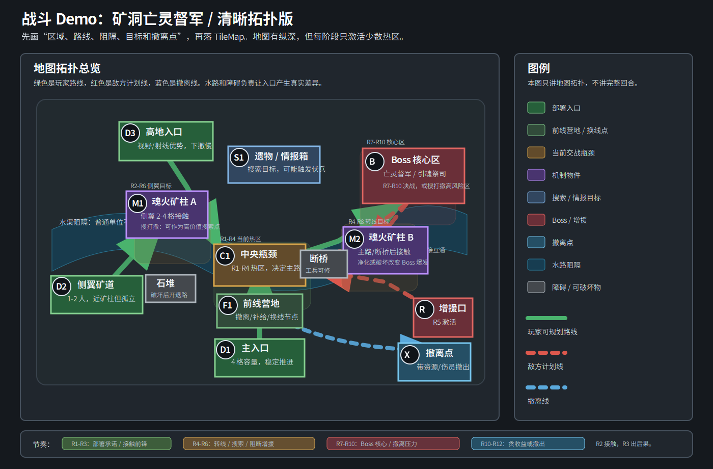
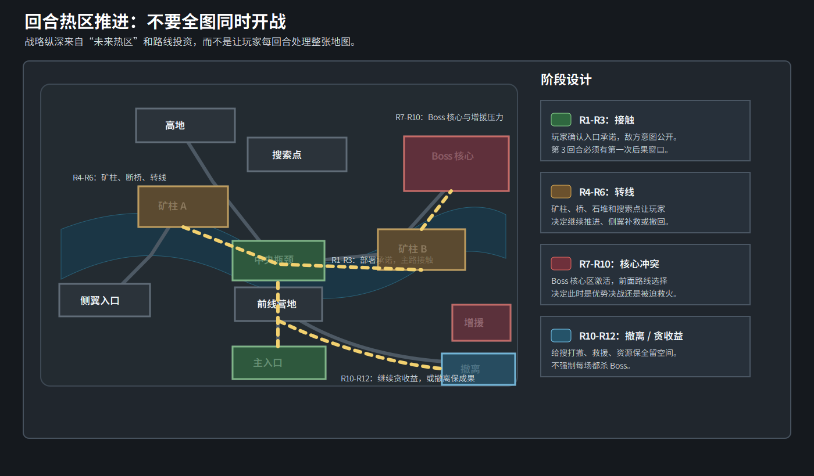
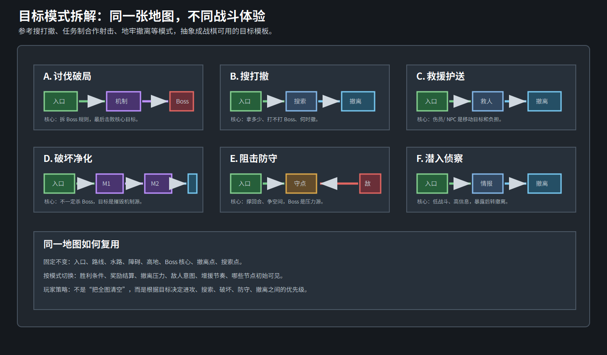

# 战斗 Demo 模拟：矿洞亡灵督军

本文是一场“最终体验模拟”，用于对齐战斗场景的目标形态。它不是实现规格，也不是数值定案；后续拆实现时应回到 `mechanism-battle-slice.md`、`../../30-technical-design/battle/battle-action-architecture.md` 和 `../../30-technical-design/battle/battle-scene-architecture.md`。

## 体验目标

```text
玩家不是在清怪，而是在指挥一支小队从多个入口压迫敌方计划。
Boss 制造魂火爆发时钟，小怪推动墓碑线和矿柱充能，地图用水渠、障碍、高地和断桥制造战略纵深。
```

本场目标回合数为 9-12 回合。第 1 回合要出现部署取舍，第 2 回合进入机制接触，第 3 回合出现第一次重大后果窗口。

## 图 1：地图拓扑

这张图只回答“入口、路线、阻隔、机制点、撤离点在哪里”。不要从 TileMap 细节开始画，先确定拓扑。



## 图 2：回合热区推进

这张图回答“哪些区域在什么时候变成有效战区”。地图有纵深，但不让玩家每回合同时处理全图。



## 图 3：目标模式复用

这张图回答“同一张地图如何支持多种战斗目标”。目标不应只有杀 Boss，也可以是搜打撤、救援、破坏、阻击或潜入侦察。



## 地图结构

地图不是一整张同时开战的大棋盘，而是“小型作战地图”：

- 主入口：4 格容量，安全，适合战士、牧师和主力英雄推进。
- 侧翼矿道：1-2 格容量，靠近魂火矿柱 A，但被水渠和石堆切断，撤退困难。
- 高地入口：1-2 格容量，适合游侠、法师或观察单位，能压制祭司和弓手，但下场路线窄。
- 水渠：普通单位不可通行，把侧翼与右侧矿柱隔开。
- 断桥：工兵可战前修复或战斗中架桥，打通中后期转线。
- 墓碑线：敌方推进兵的路线，到达后触发召唤。
- Boss 核心区：亡灵督军、祭司和骨弓手所在区域，R7-R10 进入决战。

## 目标模式

同一张地图可以切换不同目标，避免所有战斗都变成“清怪到 Boss 死”。

| 模式 | 主目标 | 战斗重点 |
|---|---|---|
| 讨伐破局 | 压制矿柱并击败 Boss | 完整 Boss 机制战 |
| 搜打撤 | 搜索遗物 / 情报 / 矿柱残片后撤离 | 收益、风险、撤离时机 |
| 救援护送 | 救 NPC 或伤员并带到撤离点 | 路线保护、伤亡压力 |
| 破坏净化 | 摧毁或净化两座矿柱后撤 | 打机制源，不一定杀 Boss |
| 阻击防守 | 守住中央瓶颈或前线营地若干回合 | 空间控制、增援压力 |
| 潜入侦察 | 拿情报后撤，暴露后转撤离战 | 低战斗、高信息收益 |

固定不变的是入口、路线、水路、障碍、高地、Boss 核心、撤离点和搜索点；按模式变化的是胜利条件、奖励结算、敌人意图、增援节奏、哪些节点初始可见。

## 战中转进与非二元结算

小战斗失败不应直接等于整个 RPG 世界失败。战斗结果应支持多档结算：

- 大胜：完成主目标，带走额外资源，关键角色无伤或低伤。
- 普通胜利：完成主目标，但消耗资源、伤员增加或部分场域受损。
- 止损撤离：没有完成主目标，但带走情报、遗物、NPC 或部分资源。
- 战术失败：主目标失败，队伍撤出，世界状态变差但本局继续。
- 灾难失败：关键单位被俘、据点受损、Boss 机制强化，进入后续补救线。

这要求英雄和兵团拥有少量“战中转进工具”。它们不是单纯输出技能，而是改变战斗目标或路线的机制技能。

示例：

| 技能类型 | 用途 | 设计限制 |
|---|---|---|
| 群体传送 | 从主路转到侧翼，或斩首后撤离 | 需要预设锚点、蓄力、冷却或高消耗 |
| 战术撤离 | 带伤员或资源撤到撤离点 | 不能携带所有目标，且会放弃当前热区 |
| 集结号令 | 把分散单位拉回前线营地 | 只影响友军，不解决敌方机制 |
| 短距换位 | 救被锁定单位，或把坦克换到危险位 | 距离短，不能跨越硬阻隔 |
| 临时开路 | 架桥、破石堆、开密道 | 消耗兵团支援或需要 1 回合施工 |
| 斩首窗口 | 集中资源击杀祭司 / 指挥单位，让小兵失控或消散 | 必须通过意图、守卫和地形制造风险 |

“传送斩首”可以成为合法打法，但不能无成本绕过地图。推荐条件：

- 斩首目标必须先被侦察或暴露。
- 传送需要锚点，例如高地入口、前线营地、工兵信标或法师标记。
- 传送后会进入孤立状态，撤离或接应成为下一阶段问题。
- 斩首成功不一定直接赢，而是改变敌人规则：召唤物消散、意图混乱、Boss 暴露或增援延迟。

亡灵战例：

```text
死灵祭司维持小兵。
玩家可以正面清兵，也可以侦察后用传送把战士和游侠送到祭司附近。
祭司死亡后，低阶骷髅直接消散，但 Boss 进入愤怒意图并封锁最近撤离线。
```

这样玩家的选择不是“打不过就失败”，而是：

```text
继续打 Boss、抢资源撤退、救人止损、传送斩首、或放弃局部目标换取世界层面的保全。
```

## 开局部署

推荐玩家开局 4 名关键角色、2 个兵团支援：

| 单位 | 推荐入口 | 战斗职责 |
|---|---|---|
| 战士 | 主入口 | 卡中央争夺区、推开推进兵、保护牧师 |
| 牧师 | 主入口 | 护盾、净化、救急，必须在救人与净化之间取舍 |
| 游侠 | 侧翼矿道 | 抢矿柱 A、标记祭司、处理孤立目标 |
| 法师 | 高地入口 | Shock 打断、范围压制、观察 Boss 意图 |
| 斥候兵团 | 战前支援 | 揭示本回合 Boss 吸能目标或墓碑推进路线 |
| 工兵兵团 | 战前 / 战中支援 | 架桥、放路障、破石堆，只能选一项优先完成 |

可替换兵团：

- 民兵：在墓碑线临时堵路，但会产生战后伤亡风险。
- 弓兵队：区域压制推进兵或祭司，但如果提前使用，会错过打断 Boss 蓄力窗口。

## Boss 与敌人

亡灵督军不是大血条，而是战场规则源。

- 每回合选择一个魂火矿柱吸取 1 层魂火。
- Boss 能量达到 3 层后，下回合释放大范围魂火爆发。
- 蓄力必须通过 Intent 显示 `charge`，吸能方向通过地图 overlay 显示。
- 爆发可以被 Shock、击退、净化矿柱、摧毁矿柱护卫、或离开范围缓解。
- 爆发不是立即秒杀，而是造成伤害、污染地块，并刷新一名亡灵推进兵。

敌人职责：

| 敌人 | 机制身份 | 玩家问题 |
|---|---|---|
| 骨盾兵 | 阻挡中央争夺区，保护墓碑线 | 先推开、击杀，还是绕路 |
| 引魂祭司 | 给矿柱充能或护盾 Boss | 远程压制祭司，还是先处理推进兵 |
| 骨弓手 | 锁定低血 / 高地单位 | 救人、护盾，还是继续压 Boss 机制 |
| 亡灵推进兵 | 沿墓碑线前进，到达后召唤 | 用主力堵路，还是派民兵承担风险 |

## 回合演示

### R1：部署承诺

Boss 意图显示为 `advance/charge` 的预告：本回合准备吸取矿柱 B。敌方推进兵显示路线，目标是墓碑线。

玩家选择：

- 主力从主入口推进到中央争夺区边缘。
- 游侠从侧翼靠近矿柱 A，但会和主力隔水相望。
- 法师在高地获得祭司视线，可预备打断。
- 工兵如果立刻架桥，R3 可让主力转向矿柱 B；如果先放路障，墓碑线压力下降。

### R2：第一次接触

骨盾兵卡住中央争夺区，祭司开始给矿柱 B 充能。游侠可以攻击矿柱 A 或射击祭司，但无法同时撤回主力。

玩家的核心问题：

```text
我现在压矿柱，还是先打通中央？
我用工兵架桥，还是用路障拖推进兵？
牧师的资源留给净化，还是给被弓手锁定的人护盾？
```

### R3：第一次后果窗口

如果矿柱 B 没被处理，Boss 进入 `charge`，下回合爆发。此时玩家至少有三种解法：

- 法师 Shock 打断 Boss，但要放弃范围压制推进兵。
- 牧师净化矿柱 B，但低血单位可能吃骨弓手攻击。
- 工兵架桥后战士转线推开祭司，但中央争夺区会空出来。

没有单一正确答案，只有不同后果。

### R4-R6：战场转线

敌方增援口激活。推进兵开始从右侧进入墓碑线。Boss 若第一次爆发被延缓，会改为召唤或控制意图。

地图开始体现战略纵深：

- 主入口玩家稳，但容易被中央拖住。
- 侧翼玩家可以破坏矿柱 A，但若石堆不破，撤退困难。
- 高地玩家输出强，但可能被骨弓手或刺客型增援针对。
- 断桥被修好后，主力能从中央转向右侧矿柱，敌人也能反向压过来。

### R7-R9：Boss 决战

Boss 核心区成为热区。此时前面选择决定决战条件：

- 如果墓碑线失守，场上会多一波亡灵，玩家需要先清线。
- 如果两个矿柱都被压住，Boss 进入短暂脆弱窗口。
- 如果侧翼角色被围，玩家要决定救援还是趁 Boss 暴露强攻。
- 如果工兵保留了支援，可以在 Boss 爆发前封路或架桥完成最后转线。

### R10-R12：收束

这部分只给章节 Boss 保留。普通精英战应在 R8-R9 结束。

可能结局：

- 机制胜利：玩家打断第二次爆发，在脆弱窗口击败 Boss。
- 惨胜：Boss 被击败，但墓碑线失守，战后据点受损或 NPC 伤亡。
- 失败升级：Boss 完成多次魂火爆发，矿洞被污染，本局后续地图状态改变。

## 玩家应感受到的策略

本场不是“Boss 出魂火，玩家带净化”。正确体验是：

```text
我从哪里进攻，会影响谁能及时处理矿柱。
我是否修桥，会影响 R4 之后主力能不能转线。
我是否让民兵堵墓碑线，会影响战后伤亡。
我是否救侧翼角色，会影响 Boss 脆弱窗口的输出。
```

## 可实现拆分

第一版不要一次实现全部。建议拆成：

1. 地图：主入口、侧翼入口、高地入口、水渠、断桥、中央争夺区。
2. 机制物件：2 个魂火矿柱，拥有 0-3 层能量。
3. Boss：吸能、蓄力、爆发、脆弱窗口。
4. 小怪：骨盾兵、引魂祭司、推进兵。
5. 玩家工具：Shock 打断、净化、护盾、推开。
6. 兵团支援：斥候揭示、工兵架桥 / 路障二选一。

验收时只看三件事：

- 第 1 回合是否有部署承诺。
- 第 3 回合是否出现可读且可反制的重大后果。
- 第 7 回合以后，玩家是否能感到前面路线选择改变了 Boss 决战条件。
