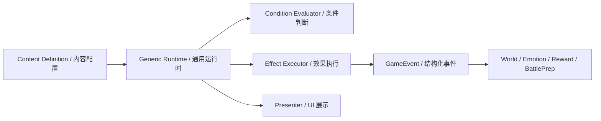

# 内容配置化架构

本项目的长期内容规则是：

```text
少量通用代码 + 大量内容配置
```

后续主要工作量会落在剧情设计、事件编排、角色互动、场域内容、奖励、关系变化和战斗遭遇配置上。代码应提供稳定的解释器、校验器和运行时合同，不应把具体剧情和场域逻辑写死在脚本里。

## 适用范围

必须优先配置化的内容：

- 战役场域：场域类型、名称、状态、显示位置、风险、建议准备、进入条件、事件池、默认遭遇、清理效果。
- 野外机会：触发区域、参与方、倒计时、目标、可介入方式、撤离规则、结果回写。
- 召唤内容：召唤池、来源展示、召唤条件、初始关系、适应事件、加入或冲突结果。
- 关系内容：关系类型、底层关系数值、关系称号 / 契约、状态转化规则和事件效果。
- 单位成长：天分、位阶、职责、亲控席位资格、晋升条件和行为包。
- 剧情事件：背景图、立绘、对话、旁白、选项、后续事件。
- 选项结果：资源变化、关系变化、情报变化、场域状态变化、触发战斗。
- 角色互动：角色条件、关系门槛、对话分支、招募结果。
- 奖励池：战利品、资源、能力、情报、场域收益。
- 遭遇配置：进入哪张战斗地图、敌人组合、出生点、Boss 机制、战前情报。
- 场域经营 / 整备：行动类型、消耗、产出、可用条件、交互点和设施槽位。

可以保留在代码里的内容：

- 通用数据结构。
- 条件判断框架。
- 效果执行框架。
- 场域状态机。
- 事件播放流程。
- 资源和关系的统一修改入口。
- 内容校验、日志和调试工具。

不应写死在代码里的内容：

- 某个具体剧情事件的台词。
- 某个具体选项给谁加几点好感。
- 某个具体场域完成后解锁哪个新场域。
- 某个具体招募事件的分支。
- 某个具体奖励三选一组合。

## 推荐运行模型



核心流程：

```text
读取内容定义
-> 检查条件
-> 展示文本、立绘、背景和选项
-> 玩家选择
-> 执行配置化效果
-> 发出结构化 GameEvent
-> 其他系统消费 GameEvent
```

## Godot 资源建议

第一阶段优先使用 Godot `Resource` 做内容定义，原因是：

- 能在编辑器里直接引用图片、场景和其他资源。
- 能配合 Godot 导入系统管理素材。
- 对 C# 类型和 Inspector 友好。
- 适合先做小规模高质量内容。

建议目录：

```text
src/Definitions/World/
src/Definitions/Characters/
src/Definitions/Battle/
src/Definitions/Maps/
assets/definitions/world/
assets/definitions/characters/
assets/definitions/battle/
```

如果后续剧情文本量变大，可以把大段文本迁移到表格、JSON、YAML 或专用剧情编辑器，但运行时仍应转换成统一 Definition 模型。

## 基础定义草案

当前世界层内容以 `../world/strategic-world-v1.md` 为准。旧战役地图原型已经从当前主流程清理，不再作为新实现入口。

### StrategicWorldDefinition

```text
Id
DisplayName
StartingSiteId
PlayerFactionId
ResourceDefinitions
FacilityDefinitions
SiteDefinitions

ActionDefinitions
ThreatRules
InitialResources
OpportunityDefinitions
```

### WorldSiteDefinition

```text
Id
DisplayName
SiteKind
Description
MapPosition
InitialOwnerFactionId
InitialControlState
FacilitySlots
InitialFacilities
InitialGarrison
BattleAnchors
EntranceDefinitions
Tags
```

### FacilityDefinition

```text
Id
DisplayName
FacilityType
BuildCosts
BuildTimeTicks
RequiredSlotTags
PassiveEffects
Actions
BattleModifiers
```

### WorldActionDefinition

```text
Id
DisplayName
Scope
AdvancesWorldTick
Conditions
Costs
Effects
FailureReasonKey
```

### ThreatRuleDefinition

```text
Id
SourceSiteId
TargetSiteId
ThreatType
TriggerConditions
InitialCountdownTicks
EnemyGroupId
ConsequenceEffects
```

### OpportunityDefinition

```text
Id
DisplayName
TriggerRegionId
ParticipantRules
AvailableEntryModes
Objectives
RetreatRules
ResultEffects
EncounterDefinitionId?
```

### WorldConditionDefinition

```text
Kind
SiteId
TargetId
FactionId
SlotTag
ResourceId
UnitTypeId
ThreatId
RuleId
Amount
ControlState
FacilityState
ThreatStage
FailureReasonKey
```

示例：

```text
HasResource("stone", >=, 4)
SiteControlState("bonefield", PlayerHeld)
HasFacility("bonefield", "defense_tower", Active)
```

### WorldEffectDefinition

```text
Kind
SiteId
TargetId
FactionId
ResourceId
FacilityId
FacilityInstanceId
SlotId
UnitTypeId
RuleId
ThreatId
Tag
BattleKind
Amount
ControlState
FacilityState
ThreatStage
```

示例：

```text
AddResource("stone", 2)
SetSiteControlState("bonefield", PlayerHeld)
AddFacility("bonefield", "tower_slot_01", "defense_tower")
CreateThreat("graveyard_raid_bonefield")
StartBattle("bonefield_assault")
AddIntel("undead_route_a")
```

## 系统边界

- 内容配置只描述“发生什么”，不直接操作具体 UI 节点或战斗节点。
- UI 只展示 Definition 转换后的 ViewModel，不直接修改资源、关系或场域状态。
- 效果执行必须走统一入口，便于日志、回放、校验和存档。
- 情感系统消费结构化事件，不让剧情脚本随意改情感内部细节。
- 战斗入口使用通用 handoff / request，不让剧情事件直接 `ChangeSceneToFile` 到具体战斗场景。
- `WorldSiteRoot` 不依赖 Strategic World，Strategic World 也不直接修改战斗内部状态。
- 召唤来源不应成为运行时玩法分支；需要玩法差异时使用抽象 trait、relationship、bond、rank、talent、duty 或 effect definition。

## 校验要求

内容规模增长后，必须提供自动或半自动校验：

- 场域 Id 是否重复。
- 场域引用的事件是否存在。
- 场域引用的遭遇是否存在。
- 场域条件是否可能达成。
- 事件引用是否存在。
- 选项是否至少有一个可见分支。
- 解锁关系是否存在不可达场域。
- 效果类型是否受支持。
- 图片、立绘、战斗场景等资源引用是否缺失。
- 玩家可见文本是否为中文。

## 当前 V1 内容状态

当前内容生产目标是 Strategic World V1：

```text
玩家营地、埋骨地、墓园分布在同一张大地图地表上
```

第一版内容应优先配置：

- 三个资源：`population`、`economy`、`stone`。
- 三个建筑：`barracks`、`mine`、`defense_tower`。
- 三个场域：`player_camp`、`bonefield`、`graveyard`。
- 基础行动：攻打埋骨地、启用矿场、建造防御塔、训练民兵、派驻民兵、等待。
- 基础威胁：墓园向埋骨地发起 Raid。
- 基础战斗入口：埋骨地攻占战、埋骨地防守战。

后续仍需要补齐：

- `RewardPoolDefinition`。
- 内容引用校验工具。
- 更正式的存档 / 读档模型。
- 战斗 objective、spawn、modifier 的完整遭遇定义。

## 反模式

需要避免：

- 为每个剧情事件写一个专属 C# 方法。
- 为具体角色组合写专属 C# 判断，例如 `if 刘备 and 张飞`。
- 在 UI 按钮回调里直接修改多个系统状态。
- 在战略地图脚本里硬编码大量具体剧情、建筑和奖励。
- 直接把事件节点暴露成地图第一层交互，导致战役地图退化成流程树。
- 用字符串散落引用角色、场域和资源，且没有校验。
- 为了一个事件绕开统一效果执行入口。

这类写法短期很快，但会让后续剧情编排和内容迭代无法规模化。
