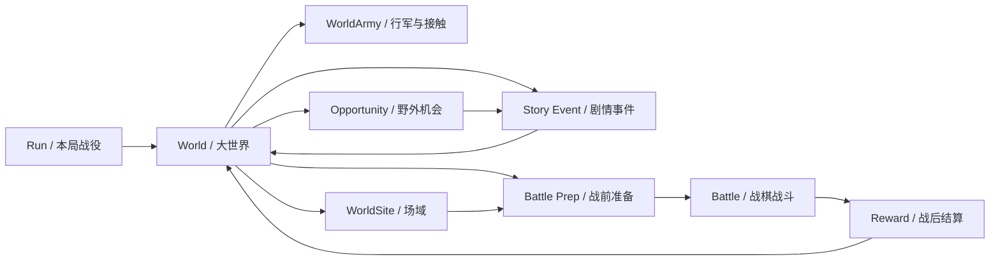

# 全局系统拆分规划

本文根据当前产品方向“玄幻大世界游历 RPG，三群式势力生态作为底层世界骨架”拆分项目系统。

这不是推翻现有代码。当前已经完成的战斗闭环、地图读取、单位组件、行动 UI、敌人意图、AI、世界入口等代码都仍然有价值。接下来的重点是给它们找到稳定位置，避免后续在同一个 Root 脚本或单个系统里继续堆职责。

## 总体判断

项目的长期结构应围绕四件事展开：

```text
世界生态给局势。
场域给玩家亲手介入的空间。
角色 / 小队给玩家身份和成长。
战斗给局部冲突可结算的结果。
```

因此系统不应只按“战斗 / UI / 地图”来拆，而要按玩家体验链路拆：

```text
开局生成
-> 大世界游历和部队移动
-> WorldSite 状态、野外机会、NPC 势力冲突或威胁
-> 玩家选择介入方式
-> 场域经营、事件、交涉、战前准备或战斗
-> 战后结算
-> 世界、场域、角色、小队、资源和威胁状态变化
-> 下一轮选择
```

## 顶层运行结构

项目仍使用 `Flow + Domain + Presentation + Definitions + Infrastructure` 分层。

在系统级别，推荐新增一个更高层的运行概念：

```text
Game Session / Run
```

一局游戏不是单场战斗，而是一段玄幻大世界游历。顶层 Flow 负责在大世界、野外机会、场域、事件、战斗和结算之间切换。



顶层 Flow 只应该传递请求和结果，不应该直接依赖具体场景节点。

示例合同：

```text
WorldEncounterRequest -> BattleStartRequest -> BattleResult -> WorldStateChange
StoryEventRequest -> StoryEventResult -> GameEvent[]
WorldSiteActionRequest -> WorldSiteActionResult -> GameEvent[]
```

## 系统拆分

### 1. Run / 局内战役系统

职责：

- 创建一局游戏。
- 保存随机种子、胜利目标、难度、局内规则。
- 持有本局大世界状态、队伍状态、场域状态和关键历史事件。
- 判断本局胜利、失败和结算。

边界：

- 不负责具体战斗规则。
- 不负责具体剧情文本。
- 不直接操作 UI 节点。

未来代码位置建议：

```text
src/Application/Run/
src/Domain/Run/
src/Definitions/Run/
```

### 2. World / 大世界探索系统

职责：

- 管理大地图地表、场域、道路、野外区域、危险区和资源机会。
- 管理 NPC 势力、敌友关系、世界计划、威胁和可见行动。
- 管理玩家小队、NPC `WorldArmy` 和敌方 Raid 的连续移动、到达、接触和拦截。
- 处理玩家进入场域、触发野外机会、加入会战、撤离或生成遭遇战。
- 维护世界状态变化，例如某区域是否安全、某场域是否受损、某 NPC 是否已被救下。

现有代码可归入：

- `src/Definitions/World/`
- `src/Presentation/World/`
- `scenes/world/`

边界：

- World 负责“在哪里、发生什么入口事件”。
- 不负责战斗内部怎么打。
- 不负责情感数值如何变化，只发出结构化事件。

### 3. WorldSite Operation / 场域经营与整备系统

职责：

- 管理可进入 `WorldSite` 的非战时经营、设施、驻军、修复、部署、资源点和局部 NPC / 对象状态。
- 支持治疗、训练、侦察、角色互动、招募、建设、拆除、升级、修复和战前准备。
- 让场域经营尽量落在小地图交互点上，而不是只停留在全屏经营菜单。
- 提供战后在当前场域整备、处理后果和决定是否返回大地图的体验。

第一版建议只保留轻量能力：

- 治疗。
- 训练。
- 侦察。
- 角色互动。
- 战前指令配置。
- 建筑槽位和驻军部署。

边界：

- 不做完整城市建造模拟。
- 不生产无限收益。
- 不直接修改战斗地图，只生成战前准备结果。

### 4. Character / 角色与单位系统

职责：

- 管理角色身份：名字、种族、职业、境界、名声、立场、性格、喜好、关系。
- 管理战斗单位能力：生命、移动、攻击、技能、阵营、目标标签、状态。
- 支持同一个角色在大世界和战斗中拥有不同表现形态。

现有代码可归入：

- `src/Presentation/Battle/Entities/`
- `src/Definitions/Battle/Abilities/`
- `docs/design/battle/unit-system.md`

设计方向：

```text
Character 是长期存在的角色身份。
BattleUnit 是 Character 进入战斗后的战斗表现。
BattleEntityComponent 是战斗侧的组合式能力挂载点。
```

边界：

- 角色系统不直接执行回合流程。
- 战斗单位不直接拥有大世界剧情推进。
- 动画配置仍属于表现层和内容配置，不进入核心规则。

### 5. Emotion / 情感与关系系统

职责：

- 独立维护角色之间、角色与玩家势力之间的情感和关系数据。
- 维护跨局稳定的种族 / 文化情感基调，并在此基础上生成 NPC 个体差异。
- 消费其他系统发出的结构化事件。
- 向剧情、招募、整顿、战斗士气等系统提供简单可消费的关系结果。

详细规则见 `emotion-system.md`。

推荐结构：

```text
数据层：种族基调、文化修正、性格、价值观、关系、信任、敬畏、亲密、冲突记忆。
逻辑层：消费 GameEvent，更新情感状态。
输出层：提供 RelationshipQuery / EmotionQuery。
```

边界：

- 情感系统不决定剧情分支文本。
- 情感系统不直接操作战斗。
- 其他系统可以读取情感结果，但不应随意改情感内部状态。

### 6. Story Event / 剧情事件系统

职责：

- 管理剧情事件池、触发条件、选项、结果和后续事件。
- 支持世界事件、场域事件、角色事件和野外机会的选择结构。
- 把玩家选择转化为结构化效果，例如资源变化、关系变化、世界状态变化、战斗遭遇。
- 以数据驱动方式维护内容：背景、立绘、对话、选项、条件和结果都应来自 Definition / 配置。

边界：

- 事件系统负责编排选择和结果。
- 情感变化通过事件结果发给 Emotion 系统处理。
- 战斗通过 `BattleStartRequest` 触发，不直接加载战斗场景。
- 未来可以接入大模型辅助文本变化，但核心规则必须保持结构化、可测试。
- 不为每个具体剧情事件写专属硬编码流程。

### 7. Battle / 战斗系统

职责：

- 管理战斗地图、Grid、单位、行动、回合、目标选择、预览、结算。
- 执行机制型小怪和 Boss 的战斗规则。
- 提供清晰的范围、路径、意图和调试可视化。

现有代码可归入：

- `src/Domain/Battle/Grid/`
- `src/Definitions/Battle/`
- `src/Definitions/Maps/`
- `src/Presentation/Battle/`
- `scenes/world/sites/`
- `docs/design/battle/technical-architecture.md`
- `docs/design/battle/battle-action-architecture.md`
- `docs/design/battle/battle-scene-architecture.md`

当前战斗代码是第一阶段最重要的可玩闭环，后续不是重写，而是继续拆出边界：

```text
WorldSiteRoot：保留顶层装配和场景生命周期。
BattleTurnController：处理回合阶段。
BattleCommandController：处理战斗命令分发。
BattleInputRouter：把输入翻译成命令。
BattlePreviewController：处理移动、攻击、意图等预览。
BattleUnitRoot：处理单位表现、组件挂载和移动表现。
BattleActionExecutor：执行行动请求。
BattleIntentController：维护敌人意图生命周期。
```

边界：

- Battle 不负责大世界生成。
- Battle 不负责长期角色关系。
- BattleResult 只返回战斗结果、伤亡、奖励、事件和世界影响建议。

### 8. Enemy Plan / 敌人计划与意图系统

职责：

- 把敌人高层作战倾向表达成玩家可理解的意图。
- 在战斗中提供图标、目标、范围、路径、倒计时和细节说明。
- 支持机制型敌人和 Boss 通过“计划”制造可读、可反制的战斗。

现有代码可归入：

- `src/Presentation/Battle/AI/`
- `src/Presentation/Battle/Intents/`
- `docs/design/battle/intent-system.md`
- `docs/design/battle/enemy-intent-design.md`

长期方向：

```text
AI Planner 负责生成高层计划。
Intent Resolver 负责把计划解析成行动请求和预览信息。
Intent UI 负责把玩家该知道的信息展示出来。
```

未来即使接行为树，也应该接在 Planner 内部，而不是让行为树直接操作战斗 UI 或地图节点。

### 9. Battle Prep / 侦察与兵团指挥系统

职责：

- 承接大世界准备对战斗的影响。
- 让侦察、工兵、弓兵、牧师团、号角等战前能力改变战斗信息和初始条件。
- 提供玩家破坏敌方作战计划的准备工具。

示例：

- 侦察成功：显示推进路径或 Boss 倒计时。
- 工兵支援：战前放置障碍。
- 弓兵支援：获得一次区域射击。
- 牧师支援：获得一次群体治疗。
- 号角：干扰敌方推进或士气。

边界：

- 兵团指挥不应变成另一套复杂微操。
- 它不直接控制战斗流程，而是修改 `BattleStartRequest` 或提供有限的战斗内支援动作。

### 10. Reward / 资源、奖励与装备系统

职责：

- 管理战斗奖励、事件奖励、资源、装备、道具、战利品选择。
- 支撑场域建设、角色成长和局内构筑。

第一版建议：

- 少量通用资源。
- 战利品三选一。
- 简单装备或能力奖励。
- 侦察、治疗、训练等整顿成本。

边界：

- 不做过多资源种类。
- 不让局外成长只堆数值。
- 奖励应扩大玩法选择，而不是单纯提高攻击力。

### 11. Content Definition / 内容定义与注册系统

职责：

- 统一管理角色、能力、地图、场域、事件、敌人模板、Boss 机制、奖励池等内容定义。
- 让系统通过 id、definition、registry 读取内容，而不是依赖具体场景路径和节点名。
- 支撑“少量通用代码 + 大量内容配置”的内容生产方式。

现有代码可归入：

- `src/Definitions/`

详细规则：

- `docs/design/architecture/content-authoring-architecture.md`

边界：

- Definition 只放数据和内容引用。
- 不在 Definition 中编排复杂运行流程。
- 运行时逻辑放在 Application 或 Domain。

### 12. Debug / 日志与调试系统

职责：

- 提供可一键关闭的调试组件。
- 提供低噪声、可落盘、可定位问题的日志。
- 提供地图、Grid、路径、意图、单位状态等调试可视化。

现有代码可归入：

- `src/Infrastructure/Logging/`
- `src/Presentation/Battle/Debug/`

规则：

- 禁止每帧无控制落盘日志。
- Debug UI 必须能统一开关。
- 日志应服务于排查问题，而不是记录所有过程细节。

## 当前代码对应关系

| 现有模块 | 新系统归属 | 后续处理方式 |
| --- | --- | --- |
| `StrategicWorldRoot` | World / 大世界表现与入口 | 保留为战略大地图场景壳，世界规则继续下沉到 Application / Domain |
| `WorldSiteRoot` | WorldSite 运行壳 / Battle 装配 | 保留为可进入场域壳，支持战时与非战时，逐步把细节下沉到控制器 |
| `WorldArmyState`、`StrategicNavigation` | WorldArmy / 大地图移动 | 作为玩家小队、敌军 Raid 和后续野外遭遇的移动基础 |
| `GridMapReader`、`BattleGridMap`、`GridCell` | Battle Grid | 继续作为地图逻辑基础 |
| `BattleMapLayer`、地图连接配置 | Battle Map Definition / Grid | 继续消费 TileMapLayer 语义和跨层连接 |
| `BattleUnitRoot`、组件 | Character / Battle Unit | 保留组合式方向，后续补 Character 与 Definition |
| `BattleActionExecutor`、Action Request | Battle Action | 继续作为行动执行入口 |
| `BattleInputRouter`、`BattleCommandController` | Battle Input / Command | 继续拆输入和命令，不回塞 Root |
| `BattleIntentController`、Intent Resolver | Enemy Plan / Intent | 保留，后续强化计划表达和预览 |
| `GreedyEnemyIntentPlanner` | Enemy Plan / AI | 作为第一版 Planner，未来可替换为行为树内部实现 |
| `BattleActionMenu`、Battle HUD | Battle UI | 保留为战斗 UI，后续接状态 presenter |
| 旧世界原型入口 | World prototypes | 已从当前主流程清理，后续不再作为实现入口 |
| `WorldSiteDefinition`、`StrategicWorldDefinition` | World Definition | 作为当前场域和战略大世界定义入口 |
| `GameLog` | Debug / Infrastructure | 继续使用，但保持低噪声和开关意识 |

## 系统通信原则

系统之间不要直接互相改内部状态，而是通过请求、结果和事件通信。

推荐三类数据：

```text
Request：我想做什么。
Result：这件事的结果是什么。
GameEvent：这件事发生后，其他系统可消费的事实。
```

示例：

```text
StoryEventResult
  -> GameEvent[]
  -> EmotionSystem 消费关系变化
  -> WorldSystem 消费世界状态变化
  -> RewardSystem 消费资源变化

BattleResult
  -> GameEvent[]
  -> WorldSystem 更新区域状态
  -> CharacterSystem 更新伤亡和成长
  -> EmotionSystem 更新羁绊和记忆
  -> RewardSystem 发放战利品
```

## 当前优先级

当前实现优先级见 `../../roadmap/development-priority.md`。系统层面的 V1 顺序是：

```text
StrategicWorldState
-> 通用资源 / 建筑 / 场域 / 威胁定义
-> 世界行动与 WorldTick
-> 战略地图 UI
-> WorldArmy / StrategicNavigation
-> BattleStartRequest / BattleResult
-> 埋骨地占领与墓园 Raid
-> 建筑和驻军影响防守
-> 保存与读取
```

战斗闭环继续保留并作为 V1 的战斗承载层，但当前主工程目标已经从“继续扩战斗内容”切换为“把大地图生态、场域经营、战斗进入和战斗回写跑通”。

## 明确不做

第一阶段不要做：

- 纯三群式统一天下主玩法。
- 完整开放世界模拟。
- 完整 4X。
- 大量资源生产链。
- 完整卡牌牌库。
- 强线性爬塔。
- 强制时间压力。
- 全量行为树框架替换。
- 全量 ECS 重构。

## 架构风险

- 如果所有系统都从 `WorldSiteRoot` 或 `StrategicWorldRoot` 直接互相调用，后续会难以扩展。
- 如果情感、剧情、场域、奖励直接修改战斗内部状态，系统会失去边界。
- 如果敌人意图只做成图标展示，而不能改变玩家决策，它会退化成装饰。
- 如果大世界准备不能改变战斗，双层结构会变成两个拼接系统。
- 如果 `WorldSite` 只剩右侧按钮菜单，项目会失去区别于普通据点经营 UI 的核心差异。
- 如果大地图只有场域攻防，没有野外机会和部队接触，项目会退回纯战略节点玩法。
- 如果角色只有数值成长，没有事件和关系记忆，项目会失去“有温度”的核心差异。

## 下一步落地点

最近一阶段推荐继续围绕现有代码做两件事：

1. 把正式战略大地图 TileMap、场域视觉层和导航层配置稳定下来。
2. 深化 `WorldArmy -> Encounter -> Battle -> World` 流程，让部队接触、野外遭遇和场域攻防都走统一 request/result。
3. 把场域经营从右侧按钮逐步落到 `WorldSiteRoot` 小地图交互点、设施锚点和持久场域记忆。

这样既不浪费当前战斗代码，也能验证“游历大世界、进入场域、改变局势”的全局产品方向。
