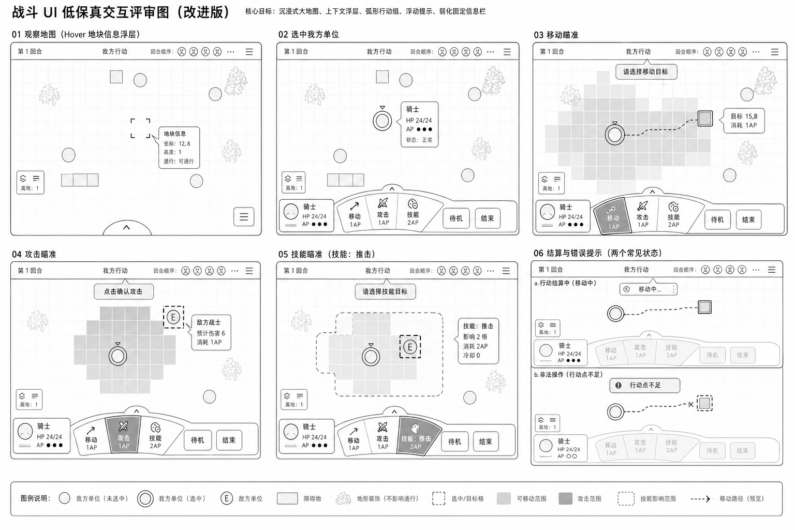
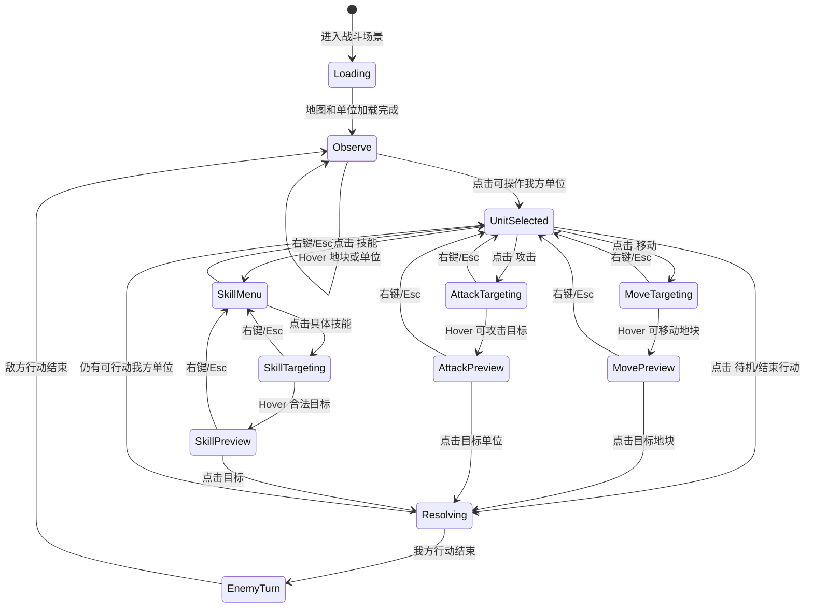
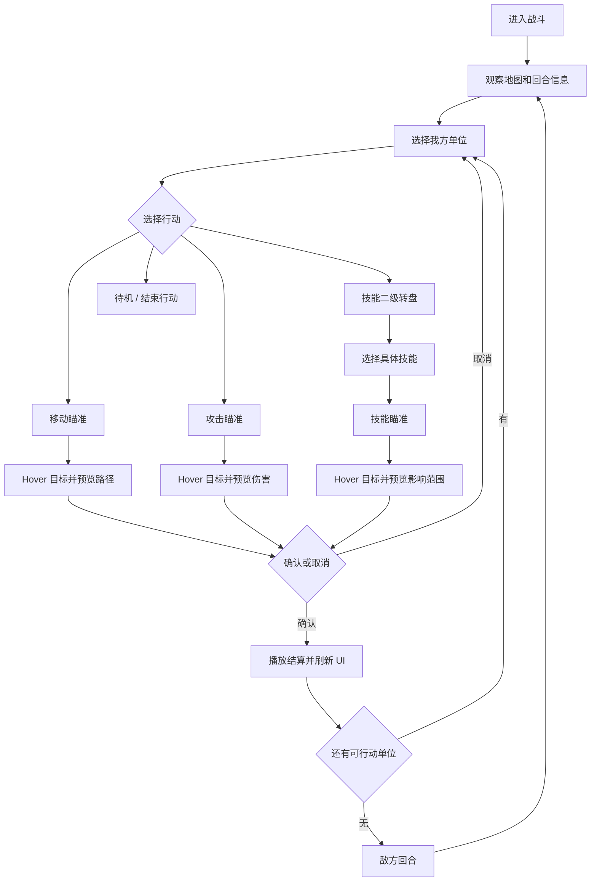
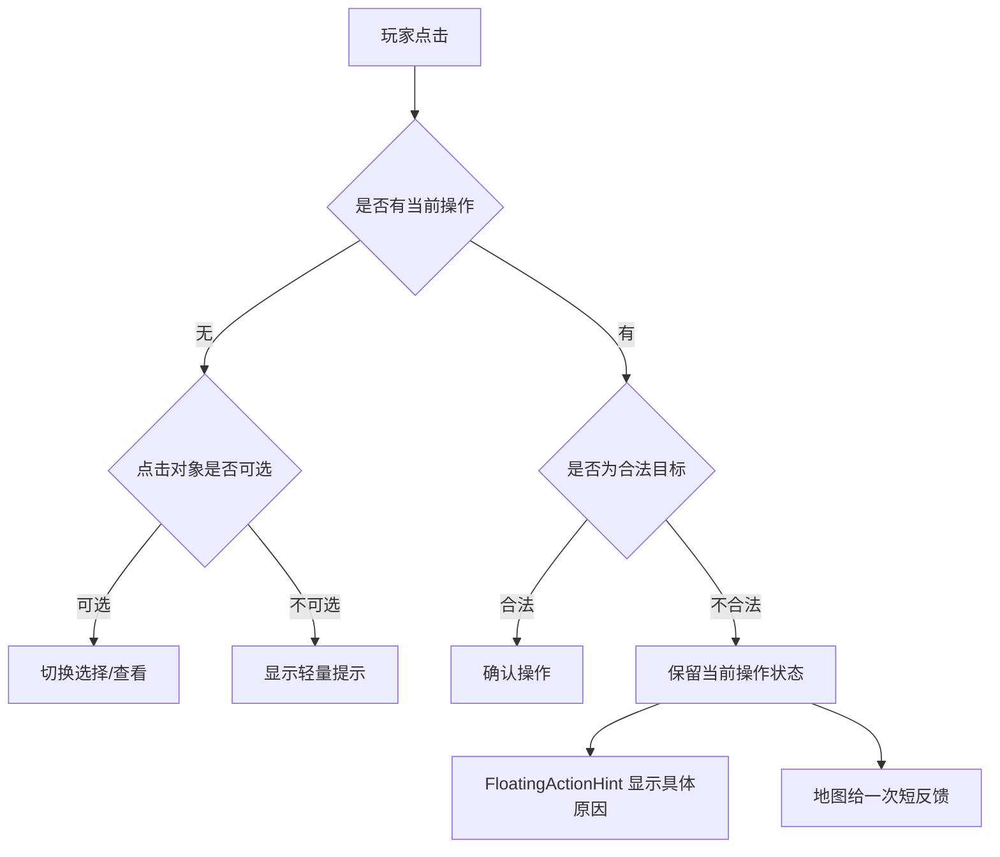

# Battle UI Interaction Review

This document is the interaction review draft for the battle HUD and map interaction layer.

It is not a visual style guide. It defines player use cases, UI state changes, interaction diagrams, and review checkpoints for the first playable battle UI.

This review uses low-fidelity wireframes only. Boxes represent layout regions and functions; they do not define final art, color, ornament, texture, or exact pixel styling. Final UI visuals should be applied later with dedicated assets.

## Review Contract

Every feature is described as:

- Preconditions: what state the battle must be in.
- Player action: input from mouse, keyboard, or UI button.
- UI delta: what changes after each step.
- Rule feedback: what the player learns immediately.
- Cancel path: how the player exits the interaction.

All player-visible in-game text defaults to Chinese.

## UI Regions

```text
+--------------------------------------------------------------------------------+
| TopTurnBar: 回合 / 当前行动方 / 当前单位 / 回合顺序                              |
+--------------------------------------------------------------------------------+
|                                                                                |
| BattleMapViewport                                                              |
| - 地图、单位、hover 框                                                         |
| - 移动 / 攻击 / 技能范围                                                       |
| - 路径和目标预览                                                               |
| - 信息卡只在 hover / 选中 / 瞄准时作为浮层出现                                  |
|                                                                                |
+--------------------------------------------------------------------------------+
| UnitStatusCard: 当前单位头像占位 / 生命 / 行动点，独立浮层                      |
+--------------------------------------------------------------------------------+
| CommandInfoPanel: 当前 hover / 选中指令说明，位于转盘鲸尾留白侧                 |
+--------------------------------------------------------------------------------+
| FloatingActionHint: 半透明行动提示 / 轻量错误 / 结算反馈，短暂显示后淡出         |
+--------------------------------------------------------------------------------+
| ActionDock: 战术行动转盘 / 待机 / 结束行动                                      |
+--------------------------------------------------------------------------------+
```

## Revised UX Direction

The battle UI should preserve the map and character art as the primary experience.

- Do not use a large permanent right-side information panel in normal play.
- Use compact contextual cards for details. They appear on hover, selection, or targeting, then hide when the context ends.
- Use an `ActionDock` instead of a generic row of rectangular buttons. Actions should feel like tactical commands, not form controls.
- AP should be represented as command cost badges and a small AP meter near the active unit status.
- Operation prompts should be floating semi-transparent hints with strong readable text, not a permanent bottom bar.
- Invalid operation feedback should use short toast text plus local map/button feedback.
- The accepted command surface is a radial `ActionWheel` inside `ActionDock`.
- `Skill` opens a secondary wheel by rotating the wheel left; right click or `Esc` rotates it back to the primary menu.
- The wheel should use an asymmetric whale-like arc, not a centered circle or symmetric ellipse. One side carries a full body mass for primary battle commands, while the other side tapers down for lower-priority or future extension commands.
- The lighter tail side should drag outward along the lower screen edge instead of curling inward.
- Layer transitions should feel like a controlled launch: the current wheel first collapses into a small yin-yang-like core with command buttons hidden, then the target layer expands out of that core with a fast middle burst, damped width ripple, and late button fade-in.
- Wheel command partitions and button centers should be distributed by approximate arc length along the whale curve, not by raw angle, so every command receives comparable visual space.
- `UnitStatusCard` and `ActionWheel` must not share the same immediate parent container. `BattleHudRoot` coordinates them as sibling HUD regions.

## Accepted Interaction Reference

This is the current review baseline for implementation.



Key decisions from this review:

- The battlefield owns most of the screen. Permanent side panels are not part of the normal battle HUD.
- Detail information appears as `ContextInfoCard` near the hovered cell, selected unit, target unit, or a safe edge anchor.
- Current operation guidance appears as `FloatingActionHint`, a semi-transparent toast that fades out.
- The bottom command area is `ActionDock`: radial `ActionWheel` in the center, utility commands to the side when needed.
- Active unit information belongs to a separate `UnitStatusCard` sibling region, not inside `ActionDock`.
- `ActionDock` should not draw a permanent full-width parent strip. It is a transparent command host; visible structure belongs to `ActionWheel` and contextual sibling panels.
- The right-side space left by the whale-tail wheel is reserved for compact contextual command information such as cost, state, and short usage text.
- `UnitStatusCard` and `CommandInfoPanel` sit to the right of the `ActionWheel` as two separate panels. They must not overlap the wheel.
- `UnitStatusCard` may use a trapezoid-like silhouette with a vertical right edge and a left edge that leans toward the action wheel. The top edge should stay longer than the bottom edge so it visually follows the wheel mass without fighting the rectangular command panel on the right.
- The `UnitStatusCard` silhouette must stay inside its actual layout bounds. Do not use negative drawing offsets to fake extension into the wheel area; the HUD layout should allocate enough width for the top edge and content safe area.
- The `UnitStatusCard` bottom edge should stay short and avoid sitting on top of the action wheel tail. The top edge may reach left toward the wheel to create the visual relationship.
- `CommandInfoPanel` remains rectangular for command readability.
- The right-side panels should be bottom-aligned and use the same height. `UnitStatusCard` keeps the asymmetric trapezoid silhouette while matching `CommandInfoPanel` height so the two panels read as one coordinated HUD group.
- The `ActionWheel` is allowed to be horizontally stretched and visually off-center so it can hold future commands such as `卡牌` and `兵团`.
- Primary wheel commands are `移动`, `攻击`, `技能`, `待机`, and `结束`.
- Command buttons show AP cost badges where relevant, for example `移动 1AP`, `攻击 1AP`, `技能 2AP`.
- `移动` and `攻击` enter targeting directly.
- `技能` opens a secondary command layer rather than immediately targeting.
- During resolution, the wheel is disabled and washed out while the locked target/path preview stays visible.
- Invalid operations do not clear targeting. They show a short hint such as `行动点不足`, `目标太远`, or `这里被阻挡`.

## Coding Semantics

These names are semantic contracts for UI implementation. Final node names may differ, but the responsibilities should remain stable.

| Concept | Responsibility | Notes |
| --- | --- | --- |
| `BattleHudRoot` | Root `CanvasLayer` or top-level `Control` for battle UI. | Does not own battle rules. |
| `TopTurnBar` | Round, acting side, active unit summary, and turn order. | Lightweight and always compact. |
| `ActionDock` | Bottom command surface for the selected controllable unit. | Owns command layout only; it must not own unit info. |
| `UnitStatusCard` | Active unit portrait placeholder, name, HP, and AP pips. | Sibling of `ActionDock` under `BattleHudRoot`. |
| `CommandInfoPanel` | Compact command info for hovered or selected wheel slot. | Sibling of `ActionDock`; uses whale-tail empty space. |
| `ActionWheel` | Radial command selector. | Owns visual menu layer and transition animation only. |
| `CommandSlot` | One actionable command on the wheel. | Displays label, icon placeholder, AP cost, cooldown, disabled reason. |
| `ContextInfoCard` | Compact hover/selection/target preview card. | Never becomes a permanent right-side panel. |
| `FloatingActionHint` | Non-blocking toast for current action guidance and errors. | Fades out; does not reserve layout space. |
| `BattlePreviewOverlay` | Map-space range, path, target, and affected area rendering. | Existing highlight overlay should evolve into this responsibility. |

### UI State Model

| State | ActionDock | ActionWheel | ContextInfoCard | FloatingActionHint | Map Preview |
| --- | --- | --- | --- | --- | --- |
| `Observe` | Collapsed or disabled. | Hidden or inactive. | Shows hover cell/unit details only when needed. | Usually hidden. | Hover bracket only. |
| `UnitSelected` | Expanded. | Primary menu. | Selected unit detail near unit or dock. | Optional `请选择行动`. | Selected ring. |
| `MoveTargeting` | Expanded. | Primary menu with `移动` active. | Destination cost near hovered target. | `请选择移动目标`. | Move range, path preview, target cell. |
| `AttackTargeting` | Expanded. | Primary menu with `攻击` active. | Damage/cost near target. | `点击确认攻击`. | Attack range and target outline. |
| `SkillMenu` | Expanded. | Secondary skill menu. | Selected skill detail if hovered. | `请选择技能`. | No target range until a skill is selected. |
| `SkillTargeting` | Expanded. | Secondary menu with selected skill active. | Skill effect preview near target. | `请选择技能目标`. | Skill range and affected area. |
| `Resolving` | Disabled. | Disabled and washed out. | Resolution summary if useful. | `移动中` / `攻击中` / `释放中`. | Locked path/target/effect preview until resolved. |
| `EnemyTurn` | Collapsed or disabled. | Hidden or disabled. | Enemy/hover details when safe. | `敌方正在行动`. | Enemy intent or result feedback. |

### ActionWheel Layers

Primary layer:

```text
移动
攻击
技能
待机
结束
```

Skill secondary layer:

```text
技能 A
技能 B
技能 C
返回
```

Interaction rules:

- Clicking `技能` rotates the wheel left into `SkillMenu`.
- Right click or `Esc` in `SkillMenu` rotates the wheel right back to the primary layer.
- Right click over any wheel slot must still cancel the current layer; slot controls must not swallow cancel input.
- If cancel is pressed during a layer transition, it must resolve immediately into the expected parent/current layer instead of requiring a second cancel.
- Clicking a usable skill enters `SkillTargeting`.
- Right click or `Esc` in `SkillTargeting` first cancels targeting and returns to `SkillMenu`.
- A second right click or `Esc` returns from `SkillMenu` to the primary layer.
- Clicking `移动`, `攻击`, `待机`, or `结束` from the primary layer exits the skill layer if it is open.
- Disabled commands remain visible but cannot enter targeting; they trigger `FloatingActionHint` with a specific reason.

### Event Semantics

Recommended UI-facing events:

| Event | Payload | UI Reaction |
| --- | --- | --- |
| `UnitSelected` | unit id, HP, AP, command availability | Update `UnitStatusCard`, expand `ActionDock`, show primary wheel. |
| `CommandHovered` | command id | Show command detail or disabled reason. |
| `CommandActivated` | command id | Set active wheel slot, request preview mode. |
| `SkillMenuOpened` | skills list | Rotate wheel left into secondary layer. |
| `SkillMenuClosed` | none | Rotate wheel right into primary layer. |
| `TargetHovered` | target cell/unit, preview data | Update `ContextInfoCard` and map preview. |
| `InvalidAction` | localized reason | Show `FloatingActionHint`, pulse local target/button. |
| `ActionResolving` | action id, actor, target | Disable wheel, lock preview. |
| `ActionResolved` | result summary | Refresh unit status, clear locked preview when feedback finishes. |

## State Notes

These notes describe the accepted wireframe in implementation terms.

### Observe

- `TopTurnBar` shows round, acting side, and compact turn order.
- `ActionDock` is collapsed or disabled.
- Hovering a cell shows the four-corner hover frame and a small `ContextInfoCard` with `坐标`, `高度`, and `通行`.
- No permanent hint bar is shown.

### UnitSelected

- Selected unit shows a ring in map space.
- `ActionDock` expands.
- `UnitStatusCard` shows name, HP, and AP pips.
- `ActionWheel` shows primary commands: `移动`, `攻击`, `技能`, `待机`, `结束`.
- Unit detail appears as a compact card near the unit or dock, not as a permanent right-side panel.

### MoveTargeting

- `移动` slot is active on the primary wheel.
- Map shows move range, path preview, and hovered destination.
- `ContextInfoCard` near the hovered target shows destination and AP cost.
- `FloatingActionHint` briefly shows `请选择移动目标`.
- Right click or `Esc` cancels targeting and returns to `UnitSelected`.

### AttackTargeting

- `攻击` slot is active on the primary wheel.
- Map shows attack range and legal target outline.
- `ContextInfoCard` near the target shows damage preview and AP cost when reliable.
- `FloatingActionHint` briefly shows `点击确认攻击`.
- Invalid target clicks preserve targeting and show a short reason toast.

### SkillMenu

- Clicking `技能` rotates `ActionWheel` left into the secondary skill layer.
- Map preview does not change until a concrete skill is selected.
- Skill slots show skill name, AP cost, cooldown, and disabled state.
- Right click or `Esc` rotates the wheel back to the primary menu.

### SkillTargeting

- Selected skill slot is active in the secondary layer.
- Map shows skill range and affected area.
- `ContextInfoCard` near the target shows effect preview, cost, and cooldown.
- `FloatingActionHint` briefly shows `请选择技能目标`.
- Right click or `Esc` first exits targeting back to `SkillMenu`.

### Resolving

- `ActionDock` remains visible but disabled and washed out.
- The locked path, target, or affected area remains visible until feedback completes.
- `FloatingActionHint` shows `移动中`, `攻击中`, or `释放中`, then fades.
- Unit status refreshes after resolution.

### Invalid Feedback

- Invalid input does not clear range, selection, or selected command.
- The local target or button pulses once.
- `FloatingActionHint` shows a specific reason, such as `行动点不足`, `目标太远`, `这里被阻挡`, or `视线被阻挡`.

### EnemyTurn

- `TopTurnBar` switches to `敌方行动`.
- `ActionDock` collapses or disables.
- Player can still inspect and move the camera when no critical animation is locking input.
- Enemy intent may be shown as map-space preview plus a small `ContextInfoCard`.

### Region Ownership

| Region | Purpose | Must Not Own |
| --- | --- | --- |
| `TopTurnBar` | Shows battle phase, round, active side, and turn order. | Targeting rules. |
| `BattleMapViewport` | Shows spatial state: cells, units, hover, selected unit, ranges, paths, and areas. | AP cost calculation. |
| `ContextInfoCard` | Shows details for selected or hovered target as a compact floating card near the relevant unit/cell or screen edge. | Battle resolution. |
| `FloatingActionHint` | Shows short Chinese guidance and invalid-operation feedback as a non-blocking toast. | Long tutorial text or persistent HUD layout. |
| `UnitStatusCard` | Shows current unit, HP, and AP in a compact independent HUD region. | Command selection or command wheel layout. |
| `CommandInfoPanel` | Shows current command cost, usage, selected state, and disabled reason. | Unit status or battle rule calculation. |
| `ActionDock` | Shows available commands in a compact tactical command surface. | Rule source of truth or unit info rendering. |
| `DebugLayer` | Shows debug-only readouts and guide grid. | Player-facing HUD content. |

## Global Interaction State



## Shared Visual Language

| Meaning | Map Style | UI Usage |
| --- | --- | --- |
| Hover cell | Four-corner bracket, no center fill. | Shows current focus. |
| Selected unit | Yellow or gold ring under unit. | The unit shown in `UnitStatusCard`. |
| Move range | Transparent blue-green fill. | Indicates legal destination cells. |
| Attack range | Transparent red fill. | Indicates legal attack targets or cells. |
| Skill range | Transparent blue-purple fill. | Indicates legal skill target range. |
| Affected area | Brighter variant of the current action color. | Indicates what will be affected if confirmed. |
| Invalid target | Dark red or gray pulse. | Used only after invalid hover/click. |
| Debug guide grid | Pale blue 16px lines. | Toggle by debug key, not part of normal HUD. |

## Common Inputs

| Input | Default Behavior |
| --- | --- |
| Mouse hover | Updates hover bracket and context info card. |
| Left click on own unit | Selects the unit if it can be inspected; enables actions only if controllable. |
| Left click on legal target | Confirms current targeting action. |
| Left click on illegal target | Does not change action state; shows localized feedback. |
| Right click | Cancels the current layer: targeting returns to its parent menu; `SkillMenu` returns to primary commands. |
| `Esc` | Same as right click for battle commands; closes temporary panels first if any exist. |
| `WASD` | Moves camera within map bounds. |
| Mouse wheel | Zooms camera within zoom bounds. |
| `F3` | Toggles all debug components. |
| `F4` | Toggles 16px guide grid when debug is enabled. |

## Primary Battle Loop



## UC-01 Enter Battle

Preconditions: battle scene is loaded, map scene is configured.

| Step | Trigger | TopTurnBar | BattleMapViewport | ActionDock | ContextInfoCard | FloatingActionHint |
| --- | --- | --- | --- | --- | --- | --- |
| 1 | System starts loading. | Hidden or shows `加载中` if loading takes visible time. | Empty or fade-in placeholder. | Hidden. | Hidden. | `正在进入战斗` |
| 2 | Map loaded. | Shows `第 1 回合` and `我方行动`. | Shows terrain, units, no large range highlights. | Shows compact neutral state. | Hidden or shows battle summary. | `请选择一个单位` |
| 3 | First controllable unit is auto-focused, if enabled. | Current unit portrait/name is highlighted. | Camera centers on that unit; selected ring may appear only if auto-select is enabled. | Shows that unit's commands. | Shows selected unit details. | `请选择行动` |

Review notes:

- If no unit is auto-selected, the UI starts in `Observe`.
- If auto-selection is enabled, the UI starts in `UnitSelected`.
- First version should choose one behavior and keep it consistent across battles.

## UC-02 Camera Pan And Zoom

Preconditions: any battle state except hard modal dialogs.

| Step | Trigger | TopTurnBar | BattleMapViewport | ActionDock | ContextInfoCard | FloatingActionHint |
| --- | --- | --- | --- | --- | --- | --- |
| 1 | Player presses `WASD`. | No change. | Camera moves; map edge never leaves viewport. Hover recalculates under cursor. | No change. | If hover target changes, details refresh. | No change. |
| 2 | Player scrolls up. | No change. | Camera zooms in; movement speed feels faster at high zoom; bounds remain clamped. | No change. | No change unless hover target changes. | No change. |
| 3 | Player scrolls down. | No change. | Camera zooms out until min zoom; viewport never becomes larger than map bounds. | No change. | No change unless hover target changes. | No change. |

Review notes:

- Camera interaction should never change selected action.
- Camera movement must not clear targeting previews.

## UC-03 Hover Tile

Preconditions: map is visible.

| Step | Trigger | TopTurnBar | BattleMapViewport | ActionDock | ContextInfoCard | FloatingActionHint |
| --- | --- | --- | --- | --- | --- | --- |
| 1 | Cursor enters a cell. | No change. | Hover bracket appears on the cell. | No change. | Shows cell summary if no unit is selected or if context card is in hover mode. | No change. |
| 2 | Cursor moves to another cell. | No change. | Previous bracket clears; new bracket appears. | No change. | Updates `坐标`, `高度`, `地形`, and occupancy. | No change. |
| 3 | Cursor leaves map. | No change. | Hover bracket clears. | No change. | Returns to selected unit details or hides if nothing selected. | No change. |

Cell context card text examples:

- `坐标：12, 8`
- `高度：1`
- `地形：高地`
- `通行：可以`
- `遮挡：否`

Debug mode may show extra layer and tile data, but the normal context card should stay compact.

## UC-04 Hover Unit

Preconditions: cursor is over a visible unit.

| Step | Trigger | TopTurnBar | BattleMapViewport | ActionDock | ContextInfoCard | FloatingActionHint |
| --- | --- | --- | --- | --- | --- | --- |
| 1 | Hover own unit. | No change. | Unit outline or subtle lift appears; cell hover remains visible. | No change. | Shows unit summary: `生命`, `行动点`, `状态`. | No change. |
| 2 | Hover enemy unit. | No change. | Enemy outline appears using enemy color. | No change. | Shows enemy summary and visible intent if available. | No change. |
| 3 | Hover unit while targeting. | No change. | If legal, target highlight intensifies; if illegal, target uses invalid hint. | No change. | Shows action preview for this target. | Legal: no change. Illegal: `目标不合法` after click, not during passive hover unless clarity requires it. |

Review notes:

- Hover should be informative but not noisy.
- Passive hover should avoid error messages unless the player clicks.

## UC-05 Select Own Unit

Preconditions: current phase allows player control.

| Step | Trigger | TopTurnBar | BattleMapViewport | ActionDock | ContextInfoCard | FloatingActionHint |
| --- | --- | --- | --- | --- | --- | --- |
| 1 | Player clicks controllable own unit. | Current unit area updates to that unit. | Selected ring appears; previous selected ring clears. | Shows `移动`, `攻击`, skill buttons, `待机`, `结束行动`; disabled commands are dimmed. | Shows full unit detail. | `请选择行动` |
| 2 | Unit has AP. | No change. | Optional move range may appear if default selected action is move. | Enabled commands show cost badges. | Shows AP and action availability. | No change. |
| 3 | Unit has no AP or already acted. | No change. | Selected ring appears, but action range does not auto-open. | Commands disabled except inspect-related commands. | Shows `已行动` or `行动点不足`. | `该单位本回合无法行动` |

Review notes:

- Selection and controllability are separate. Enemy and exhausted units can be inspected, but not commanded.
- Disabled buttons must explain why through tooltip, context card, or `FloatingActionHint`.

## UC-06 Select Enemy Unit

Preconditions: map is visible.

| Step | Trigger | TopTurnBar | BattleMapViewport | ActionDock | ContextInfoCard | FloatingActionHint |
| --- | --- | --- | --- | --- | --- | --- |
| 1 | Player clicks enemy unit in observe state. | No change. | Enemy inspect ring appears; own selected unit ring clears only if no action is active. | If no own unit selected, remains neutral. | Shows enemy details and visible intent. | `正在查看敌人` |
| 2 | Player clicks enemy unit while own unit selected. | No change. | Enemy inspect ring appears; own selected ring remains if the UI supports secondary inspect. | Own unit actions remain visible. | Shows enemy details while keeping selected unit context in `UnitStatusCard`. | No change. |
| 3 | Player clicks enemy while attack targeting and target is legal. | No change. | Target highlight intensifies; affected preview appears. | Attack button remains active. | Shows attack result preview. | `点击确认攻击` |

Review notes:

- Inspecting an enemy must not accidentally cancel the selected own unit during targeting.
- If this becomes confusing, use a clear primary selected ring and secondary inspected outline.

## UC-07 Move Action

Preconditions: own unit is selected, unit can move.

| Step | Trigger | TopTurnBar | BattleMapViewport | ActionDock | ContextInfoCard | FloatingActionHint |
| --- | --- | --- | --- | --- | --- | --- |
| 1 | Player clicks `移动`. | No change. | Move range appears in blue-green. Selected unit ring remains. | `移动` button enters active state; other commands remain visible but inactive-looking. | Shows movement cost rules. | `请选择移动目标` |
| 2 | Hover legal destination. | No change. | Destination cell brightens; path preview appears. | No change. | Shows target cell and AP cost. | `点击确认移动` |
| 3 | Hover illegal destination. | No change. | Hover bracket appears; illegal cell may pulse dark red only if useful. | No change. | Shows why not legal if known: height, blocked, out of range. | No message until click, or `无法到达` if preview policy is explicit. |
| 4 | Click legal destination. | No change during input. | Target cell flashes; range locks during resolution. | Buttons disabled during movement. | Shows `移动中` or keeps selected unit detail. | `移动中` |
| 5 | Movement resolves. | Active unit remains or next unit updates based on rules. | Unit position updates; move range clears; selected ring follows unit. | AP badge updates; `移动` disabled if movement is consumed. | Shows updated unit AP and position. | `移动完成` then `请选择行动` |
| 6 | Right click or `Esc`. | No change. | Move range and path preview clear; selected ring remains. | `移动` exits active state. | Returns to selected unit detail. | `请选择行动` |

Invalid click feedback:

| Situation | FloatingActionHint | Map Feedback |
| --- | --- | --- |
| Destination out of range. | `超出移动范围` | Illegal cell pulse. |
| Cell blocked. | `这里被阻挡` | Blocking object or unit outline pulses. |
| Height transition invalid. | `高度无法通行` | Target cell and edge hint pulse. |
| AP not enough. | `行动点不足` | Button shake or dim flash. |

## UC-08 Basic Attack

Preconditions: own unit is selected, unit has an available basic attack.

| Step | Trigger | TopTurnBar | BattleMapViewport | ActionDock | ContextInfoCard | FloatingActionHint |
| --- | --- | --- | --- | --- | --- | --- |
| 1 | Player clicks `攻击`. | No change. | Attack range appears in transparent red. | `攻击` button enters active state. | Shows attack name, AP cost, and target rule. | `请选择攻击目标` |
| 2 | Hover legal enemy target. | No change. | Target outline brightens; affected cell or line appears. | No change. | Shows damage preview if reliable. | `点击确认攻击` |
| 3 | Hover empty legal cell if attack targets cells. | No change. | Cell brightens; affected area appears. | No change. | Shows affected cells and possible units. | `点击确认攻击` |
| 4 | Hover illegal target. | No change. | Hover bracket remains; target does not use legal highlight. | No change. | Shows basic info, not result preview. | No message until click. |
| 5 | Click legal target. | No change during input. | Attack range locks; target flashes. | Buttons disabled during resolution. | Shows `攻击中` or result preview until resolved. | `攻击中` |
| 6 | Attack resolves. | May update current unit or phase. | Attack range clears; HP bars update; damage number or hit feedback appears. | AP and command availability refresh. | Shows updated target if still inspected. | `攻击完成` then next actionable prompt. |
| 7 | Right click or `Esc`. | No change. | Attack range clears. | `攻击` exits active state. | Returns to selected unit detail. | `请选择行动` |

Invalid click feedback:

| Situation | FloatingActionHint | Map Feedback |
| --- | --- | --- |
| Target out of range. | `目标太远` | Red range boundary pulse. |
| No line of sight. | `视线被阻挡` | Blocking line or object pulse. |
| Wrong faction. | `不能攻击该目标` | Target outline dark red pulse. |
| AP not enough. | `行动点不足` | Attack button dim flash. |

## UC-09 Skill Action

Preconditions: own unit is selected and has at least one skill.

| Step | Trigger | TopTurnBar | BattleMapViewport | ActionDock | ContextInfoCard | FloatingActionHint |
| --- | --- | --- | --- | --- | --- | --- |
| 1 | Player clicks `技能` on the primary wheel. | No change. | No map change until a skill is chosen. | `ActionWheel` rotates left into the secondary skill layer. | Shows hovered skill detail if any. | `请选择技能` |
| 2 | Player selects a usable skill. | No change. | Skill range appears in transparent blue-purple. | Selected skill slot becomes active in the secondary layer. | Shows selected skill detail. | `请选择技能目标` |
| 3 | Hover legal target. | No change. | Target brightens; affected area appears in brighter skill color. | No change. | Shows predicted effect: damage, push, block, status, or affected units. | `点击确认释放` |
| 4 | Hover illegal target. | No change. | Hover bracket only; no affected area. | No change. | Shows target info but not result preview. | No message until click. |
| 5 | Click legal target. | No change during input. | Skill range locks; affected area flashes. | Buttons disabled during resolution. | Shows `释放中`. | `释放中` |
| 6 | Skill resolves. | May update phase or active unit. | Skill range clears; result feedback plays; status icons update. | AP, cooldown, and command availability refresh. | Shows updated unit or target details. | `技能释放完成` |
| 7 | Right click or `Esc` while targeting. | No change. | Skill range clears. | Returns to secondary `SkillMenu`; selected skill active state clears. | Returns to skill detail or selected unit detail. | `请选择技能` |
| 8 | Right click or `Esc` in `SkillMenu`. | No change. | No change. | `ActionWheel` rotates right back to the primary layer. | Returns to selected unit detail. | `请选择行动` |

Skill button states:

| State | Button Visual | Tooltip / Detail Text |
| --- | --- | --- |
| Usable | Normal, cost badge visible. | `消耗 2 行动点` |
| AP insufficient | Dimmed. | `行动点不足` |
| Cooldown | Dimmed with cooldown badge. | `冷却中：2 回合` |
| No legal target | Dimmed or normal depending design policy. | `没有合法目标` |
| Locked by status | Dimmed with status icon. | `无法使用：沉默` |

## UC-10 Cancel Current Action

Preconditions: player is in move, attack, or skill targeting.

| Step | Trigger | TopTurnBar | BattleMapViewport | ActionDock | ContextInfoCard | FloatingActionHint |
| --- | --- | --- | --- | --- | --- | --- |
| 1 | Player presses right click in move or attack targeting. | No change. | Current range, path, and affected area clear. Hover bracket may remain. | Primary wheel remains open; active slot returns to normal. | Returns to selected unit detail. | `请选择行动` |
| 2 | Player presses right click in skill targeting. | No change. | Skill range and affected area clear. | Wheel returns to secondary `SkillMenu`. | Returns to skill detail or selected unit detail. | `请选择技能` |
| 3 | Player presses right click in `SkillMenu`. | No change. | No change. | Wheel rotates right back to primary commands. | Returns to selected unit detail. | `请选择行动` |
| 4 | Player presses `Esc`. | No change. | Same as right click for the current command layer. | Same as right click. | Same as right click. | Matches the resulting layer. |
| 5 | Player clicks another primary action while targeting. | No change. | Old range clears; new action range appears if applicable. | Wheel switches to that action; skill layer closes if open. | Shows new action detail. | Updates to new action hint. |

Review notes:

- Cancel must not deselect the current unit.
- Switching actions should feel intentional and should not require cancel first.

## UC-11 Wait Or End Action

Preconditions: own unit is selected.

| Step | Trigger | TopTurnBar | BattleMapViewport | ActionDock | ContextInfoCard | FloatingActionHint |
| --- | --- | --- | --- | --- | --- | --- |
| 1 | Player clicks `待机`. | No change during confirmation-free first version. | Selected ring remains until state updates. | Buttons disable during resolution. | Shows current unit. | `正在待机` |
| 2 | Wait resolves. | Turn order advances if needed. | Unit gets `已行动` visual marker if used. | Current unit changes or `ActionDock` enters neutral state. | Shows next unit or previous unit as inspected. | `待机完成` |
| 3 | No player units remain actionable. | Shows `敌方行动`. | Player range previews clear. | Player commands hidden or disabled. | Shows active enemy or no selection. | `敌方正在行动` |

Review notes:

- First version can make `待机` and `结束行动` the same action.
- If both exist later, `待机` should preserve remaining AP by rule only if battle design needs it.

## UC-12 Enemy Turn

Preconditions: battle phase is enemy action.

| Step | Trigger | TopTurnBar | BattleMapViewport | ActionDock | ContextInfoCard | FloatingActionHint |
| --- | --- | --- | --- | --- | --- | --- |
| 1 | Enemy phase starts. | Shows `敌方行动`. | Player selected ring and ranges clear. | Player commands disabled or collapsed. | Shows active enemy if visible. | `敌方正在行动` |
| 2 | Enemy starts an action. | Current unit updates to enemy. | Camera may follow enemy; intent preview may show. | No player commands. | Shows enemy action if visible. | `敌人正在行动` |
| 3 | Enemy resolves action. | No change unless turn order advances. | Result feedback plays; HP/status updates. | No player commands. | Updates affected unit details if inspected. | Short result text if needed. |
| 4 | Enemy phase ends. | Shows `我方行动`. | Next controllable unit may be focused. | Player commands return after selection or auto-select. | Shows current player unit or clears. | `请选择一个单位` or `请选择行动` |

Review notes:

- Player can still pan, zoom, and inspect while enemy acts unless a critical animation locks input.
- Inspection must not interrupt enemy AI resolution.

## UC-13 Turn Order Inspection

Preconditions: top turn order is visible.

| Step | Trigger | TopTurnBar | BattleMapViewport | ActionDock | ContextInfoCard | FloatingActionHint |
| --- | --- | --- | --- | --- | --- | --- |
| 1 | Player hovers a turn order portrait. | Portrait enlarges or highlights. | Matching unit gets temporary outline. | No change. | Shows unit summary. | No change. |
| 2 | Player clicks a portrait. | Portrait becomes inspected. | Camera may pan to unit if click-to-focus is enabled. | No command change unless it is the current controllable unit. | Shows full unit details. | `正在查看单位` |
| 3 | Cursor leaves portrait. | Portrait returns to normal unless selected/active. | Temporary outline clears. | No change. | Returns to previous context info card. | No change. |

Review notes:

- Hovering turn order should not change active unit.
- Clicking should inspect or focus, not reorder turns.

## UC-14 Invalid Operation Feedback

Preconditions: any interactive battle state.



| Invalid Case | UI State After Click |
| --- | --- |
| Empty cell clicked in observe state. | Hover remains; no selection; hint may stay unchanged. |
| Enemy clicked when not targeting. | Enemy becomes inspected, not attacked. |
| Own exhausted unit clicked. | Unit inspected; commands disabled; `FloatingActionHint` shows `该单位本回合无法行动`. |
| Illegal move target clicked. | Stay in move targeting; range remains; `FloatingActionHint` gives reason. |
| Illegal attack target clicked. | Stay in attack targeting; range remains; `FloatingActionHint` gives reason. |
| Disabled command clicked. | No targeting state; button gives dim flash; tooltip or `FloatingActionHint` gives reason. |

Feedback rules:

- Do not open a modal for normal invalid operations.
- Do not clear the player's current targeting state on invalid click.
- Always prefer a specific Chinese reason over generic `无法操作`.

## UC-15 Debug Toggles

Preconditions: battle scene is active.

| Step | Trigger | TopTurnBar | BattleMapViewport | ActionDock | ContextInfoCard | FloatingActionHint |
| --- | --- | --- | --- | --- | --- | --- |
| 1 | Press `F3` when debug is on. | No change. | Debug overlays and panels hide. Normal hover and range remain. | No change. | Normal `ContextInfoCard` remains if separate from debug. | No player-facing hint required. |
| 2 | Press `F3` when debug is off. | No change. | Debug overlays return to previous per-component state. | No change. | Debug cell info can appear if enabled. | No player-facing hint required. |
| 3 | Press `F4`. | No change. | 16px pale-blue guide grid toggles. | No change. | No change. | No player-facing hint required. |

Review notes:

- Debug UI must be controlled by a debug root, not mixed into the formal battle HUD.
- Debug toggles can show editor/developer messages, but not normal player-facing hints.

## UI State Matrix

| State | Map Highlights | ActionDock | ContextInfoCard | FloatingActionHint |
| --- | --- | --- | --- | --- |
| `Observe` | Hover only. | Collapsed or disabled. | Hovered cell/unit details only when needed. | Usually hidden. |
| `UnitSelected` | Selected ring. | Expanded primary wheel. | Selected unit detail. | Optional `请选择行动` |
| `MoveTargeting` | Move range, selected ring, hover. | Move active. | Move cost / destination detail. | `请选择移动目标` |
| `AttackTargeting` | Attack range, selected ring, hover. | Attack active. | Attack detail / target detail. | `请选择攻击目标` |
| `SkillMenu` | Selected ring only. | Secondary skill wheel. | Hovered skill detail. | `请选择技能` |
| `SkillTargeting` | Skill range, selected ring, hover. | Selected skill active in secondary wheel. | Skill detail / target detail. | `请选择技能目标` |
| `Resolving` | Locked preview or result feedback. | Temporarily disabled. | Resolving actor/target. | `移动中` / `攻击中` / `释放中` |
| `EnemyTurn` | Enemy intent or result feedback; no player ranges. | Player commands disabled/collapsed. | Active enemy or hovered object. | `敌方正在行动` |

## First-Version Acceptance Checklist

- Enter battle shows a stable HUD with Chinese text.
- Hovering a cell updates map hover and `ContextInfoCard` without selecting anything.
- Selecting an own unit updates selected ring, `UnitStatusCard`, `ActionDock`, and contextual unit detail together.
- Selecting or hovering an enemy never accidentally executes an attack.
- Move, attack, and selected skill targeting each have a distinct active wheel state and map range.
- Clicking `技能` opens the secondary skill wheel before targeting.
- Right click and `Esc` cancel targeting without deselecting the unit.
- Right click and `Esc` in the skill layer return one layer at a time.
- Invalid target clicks preserve targeting state and show specific feedback.
- Enemy turn disables player commands but allows camera and inspection when safe.
- Debug UI can be hidden independently from normal HUD.
- Camera pan and zoom do not reset selected unit, hover, or targeting state.

## Open Review Questions

- Should battle start in `Observe` or auto-select the first controllable unit?
- Should clicking turn order focus the camera, inspect the unit, or both?
- Should `待机` and `结束行动` be one button in the first version?
- Should movement range appear immediately after selecting a unit, or only after clicking `移动`?
- Should `ContextInfoCard` prioritize selected unit details or hovered target details during targeting?

